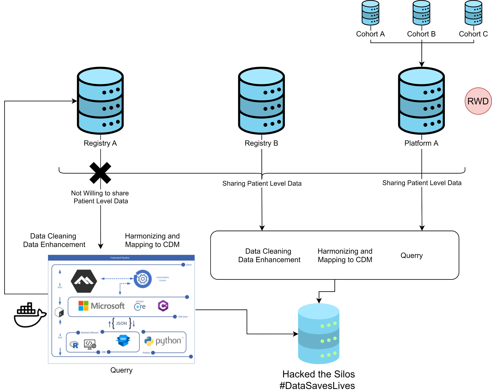

# Hack4Health

[#dataSavesLives](https://datasaveslives.eu/)

This repository is a collection of the code created during the Hack4Health hackathon by team FAIRy tale for the #HackTheSilos challenge. We envision a world where health data is available at the right time, at the right place in a common standard to the people that need it. All software should be available as open source software, in order to ensure the highest re-usability and transparency. At Hack4Health 2021, we made the first step towards this. This repository is our starting point, everyone is invited to contribute, re-use and hack our solutions.

Be open, flexible and FAIR. #dataSavesLives

## Our Approach

The figure shows an overview of possible data silos and the data flows from them. You can see individual data silos at the top. All silos have the possibility to either share - with according ethics and privacy approvals that is - the data in their custody directly (right side) or employ the pre-processing and query steps themselves (left side). Our tools aim to be flexible as well as portable. All components are freely modififiable, forkable, re-usable and deployable.

We want to strengthen the #DataSavesLives message and show the means to unlock data silos without giving up the sovereignty as a data custodians.

## Data-Generator

Mock data generator to create datasets (in CSV format) based on configurable distributions for each attribute.

## User-Interface

The exemplary UI presented in our pitch.

